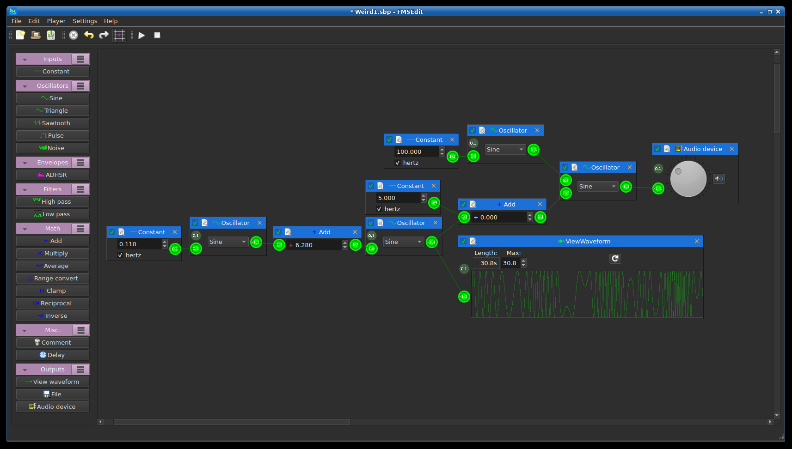

# libfmsynth
This is a C++ library to generate audio using frequency modulation synthesis (https://en.wikipedia.org/wiki/Frequency_modulation_synthesis). Node based architecture is used, where each node presents some operation performed. Each node can have zero or more input signals, and zero or one output signal. Some nodes are editor-only, for example the comment node.

In addition to the library, some supporting executable programs are provided:
* fmsedit - Editor, uses QT. 
* fmsplay - Plays a single file.

The files used are named "*.sbp" (short from SynthBluePrint), and their contents are in JSON.


## License
Copyright (C) 2021  Steve Joni Yrjänä <joniyrjana@gmail.com>

This program is free software: you can redistribute it and/or modify
it under the terms of the GNU General Public License as published by
the Free Software Foundation, either version 3 of the License, or
(at your option) any later version.

Complete license can be found in the LICENSE file.


## Build and install using a release
Autotools build system is used, so the procedure to build is:
```
$ ./configure && make
```
And then installing:
```
# make install
```
### Uninstall
```
# make uninstall
```


## Build and install when not using a release
The autotools build system needs to be bootstrapped to create the 'configure' script:
```
$ autoreconf --include=m4 --install
```
After that, the procedure is the same as when using a release:
```
$ ./configure && make
```
And so on.

See the 'project.sh' for more information/example.
